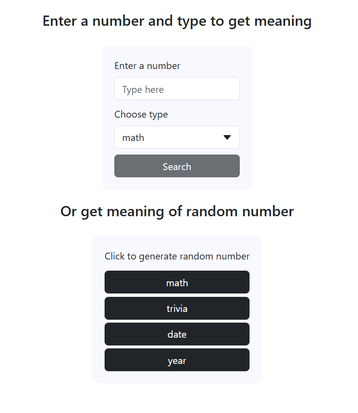
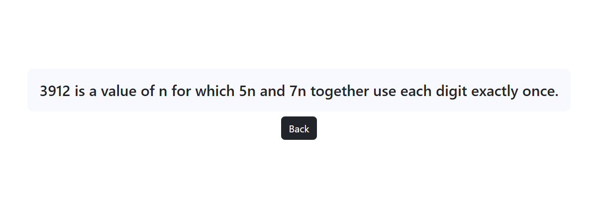

- Images

- There are two routes in this application. `/` and `/meaning`.
- `/` is a home page and here we can enter number and type to get meaning of this number. or we can generate random meaning clicking random generator buttons.
- after clicking `search` or `random` buttons, user is redirected to `/meaning` page with meaning of the number.
- Source code you can find [here](https://github.com/Hakimbek/numbers-meaning).
- You can find video [here](https://youtu.be/Mss-vBFzFLU) 